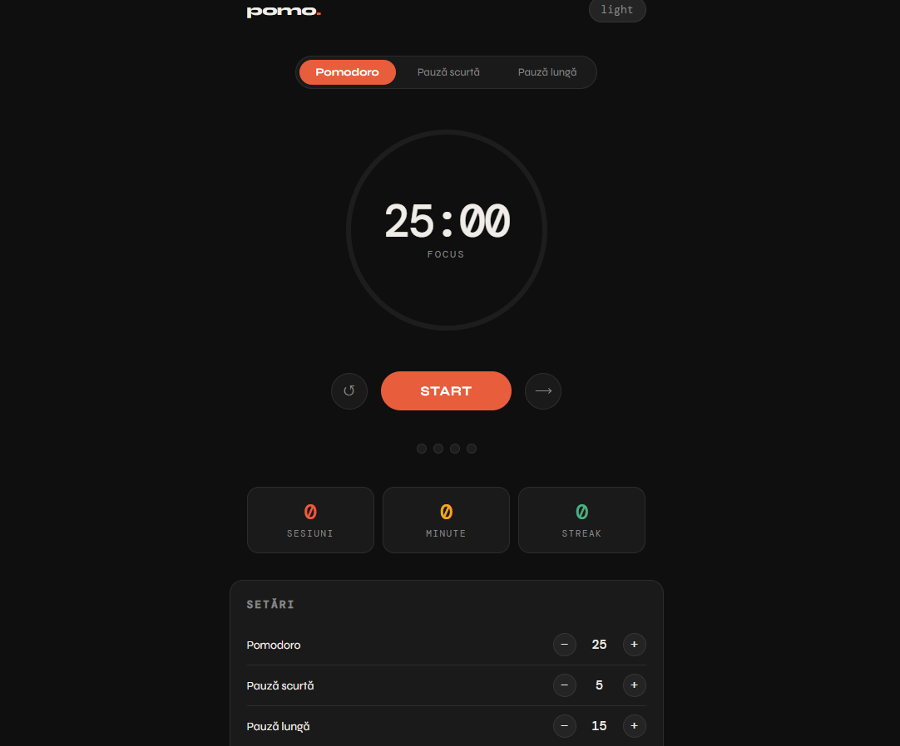

# 🍅 pomo. — Pomodoro Timer App

A clean, minimal Pomodoro timer built with **React** and **TypeScript**. Designed to boost focus and productivity using the Pomodoro Technique.

  

---

## ✨ Features

- **Three modes** — Pomodoro (focus), short break, long break
- **Animated ring timer** — SVG progress ring that updates in real time
- **Auto-switch** — automatically transitions between work and break sessions
- **Session tracker** — dots that track your progress through a 4-session cycle
- **Statistics** — total sessions completed, minutes focused, and current streak
- **Persistent stats** — data saved to localStorage, survives page refresh
- **Customizable durations** — adjust Pomodoro, short break, and long break lengths
- **Light / Dark theme** — toggle between themes with one click

---

## 🚀 Getting Started

```bash
# Clone the repository
git clone https://github.com/AdrianaBalica/pomodoro-app.git

# Navigate into the project
cd pomodoro-app

# Install dependencies
npm install

# Start the development server
npm run dev
```

Open [http://localhost:5173](http://localhost:5173) in your browser.

---

## 🛠️ Built With

| Technology | Purpose |
|------------|---------|
| React 18 | UI framework |
| TypeScript | Type safety |
| Vite | Build tool & dev server |
| CSS-in-JS (inline styles) | Styling & theming |
| localStorage | Stats persistence |

---

## 📁 Project Structure

```
pomodoro-app/
├── public/
├── src/
│   ├── App.tsx        # Main Pomodoro component
│   └── index.tsx      # React entry point
├── index.html
├── vite.config.ts
├── tsconfig.json
└── package.json
```

---

## 🎯 How It Works

The app follows the classic **Pomodoro Technique**:

1. Work for **25 minutes** (one Pomodoro)
2. Take a **5-minute** short break
3. Repeat 4 times
4. Take a **15-minute** long break
5. Repeat 🔁

All durations are fully customizable from the settings panel at the bottom of the app.

---

## 📸 Preview



---

## 📄 License

MIT — feel free to use, modify, and distribute.
